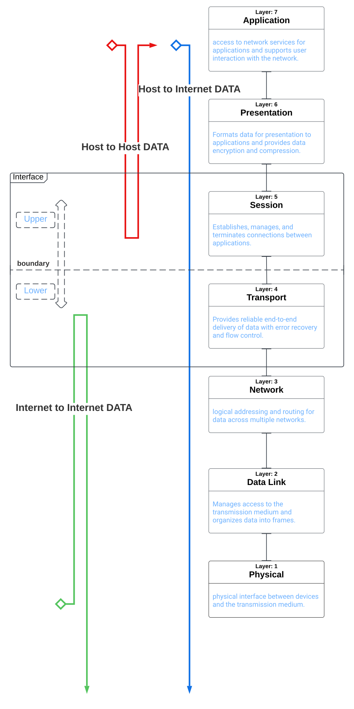

Title: The Interplay of Session and Transport Layers: Bridging Upper and
Lower Packet Transfers

Abstract:

This research paper focuses on the interconnection and collaboration of
the session and transport layers (layers 5 and 4) within the OSI model.
By analyzing their unique relationship and functioning as an abstract
machine, this paper explores their role as a logical communication
channel for authenticating and transporting data packets. The concept of
the interface between upper and lower layers is introduced, emphasizing
its significance in guiding packet traffic. Insights from the book
\"CCNA Certification All-in-One For Dummies\" by Silviu Angelescu (2010)
form the basis of this study.

1\. Introduction

In the realm of packet transfers, the session and transport layers
(layers 5 and 4) play a critical role in ensuring seamless
communication. This paper delves into their interconnected nature,
shedding light on their collaboration as an abstract machine and their
contribution to establishing logical communication channels.

2\. Collaboration and Proximity of the Session and Transport Layers

The session and transport layers possess a unique synergy, with a closer
working relationship compared to other layers. As we examine their
operations, it becomes evident that they function together as an
abstract machine, acting as a logical communication channel for
authenticated and transported data packets. This section explores their
interplay and its significance.

3\. The Interface: Bridging Upper and Lower Layers

Within the OSI model, the session and transport layers serve as a vital
interface between upper and lower layers. This interface facilitates the
smooth passage of traffic as it traverses from upper layers to lower
layers and vice versa. The concept of the interface is discussed in
detail, highlighting its role as a guide for packet traffic. Its
significance in bridging the gap between different layers is
underscored.

4\. Understanding the Logical Communication Channel

When data must travel from upper layers to lower layers, the logical
communication channel established by the session and transport layers
becomes pivotal. This channel is entirely composed of layers 5 and 4,
forming the backbone for transmitting packets. The intricacies and
functioning of this logical communication channel are explored, shedding
light on its role in packet transfers.

5\. Conclusion

The collaboration between the session and transport layers within the
OSI model provides a crucial foundation for efficient and secure packet
transfers. By acting as an abstract machine and establishing logical
communication channels, these layers bridge the gap between upper and
lower layers. Understanding their interplay and the interface they
create enhances our comprehension of network communication dynamics.

Keywords: Session layer, transport layer, OSI model, abstract machine,
logical communication channel, interface, packet transfers, network
communication, upper layers, lower layers.

Acknowledgement: This document was enhanced using Chat GPT.
