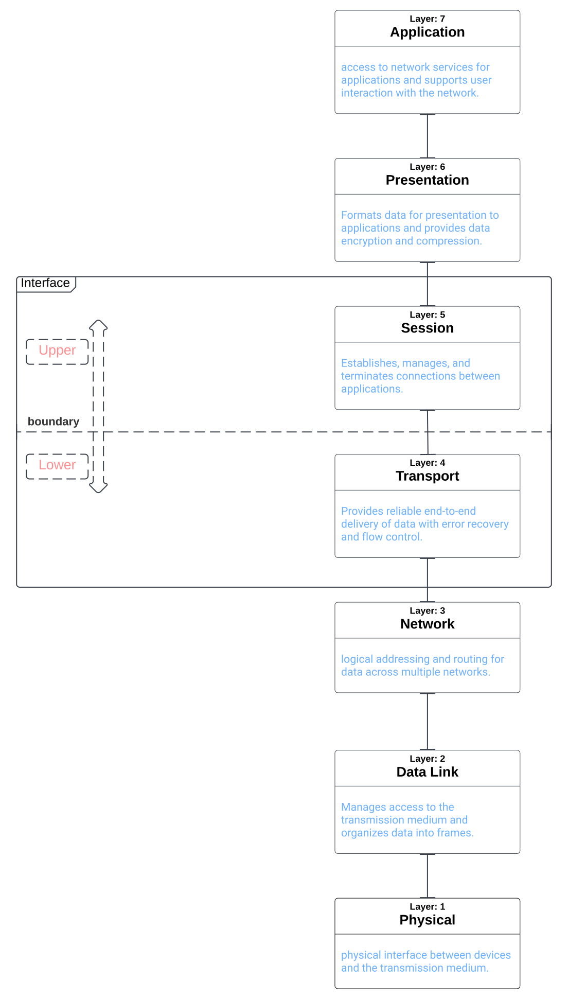

**Author: Sheldon Reed**

**Entry Date: 12/27/22**

**The Life of a Packet: OSI model Insights**

Starting from the application layer, the security of a packet begins at
the presentation layer.

Along with that, the presentation layer is where the data is
converted/prepared into the format needed to either be resource to an
application or, pass through the session and transport layers jointly,
to any of the 3 remaining layers for work to be done upon.

Here I have organized the upper and lower layers as individual separated
units of any operation on any packet(s).

I argue that in this model, the Session and Transport layers act as
interfaces for the upper and lower units '[categories of
work'] to be done. -on packets

Categories of work being, moving packets from application to
session(upper layers) or, Transporting Packets to foreign host (lower
layers).

This study was gleaned from the book:

**Angelescu, Silviu. CCNA Certification All-in-One For Dummies. Wiley
Publishing, Inc. 2010.**
