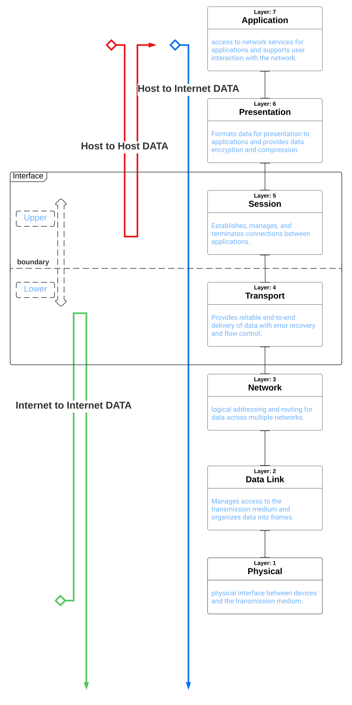

**Author: Sheldon Reed**

**Entry Date: 12/27/22**

**Context:** upper packets transfer layer packets transfer
across [interface] to lower layers for [Foreign Host
Delivery.]

**The Session/Transport Layer Inter-Connected Machine.**

The session and transport layers (5 and 4) [work together]
'particularly' closer with one-another [than others.] They
work with one-another as an 'abstract [machine]' of sorts.
An abstract machine that is the [logical-communication]
(connection-oriented) channel.

\-[Between separate processes, networks or, Hosts.]

When this 'machine' handles the work of [authenticating] and
[transporting] data (packets[)] across a
[logical communication channel] (or even, a
connection-oriented circuit), this logical communication channel is
entirely made up of layers 5 and 4.

I call it an Interface between, vice-versa, upper and lower layers due
to the [fact] that when traffic must travel down to any
lower layer (from any upper layer), it [must] pass through,
this abstract inter-connected boundary that I firmly
believe Interfaces -(bridges) the upper and lower layers respectively.
-A guide for traffic.

This study was gleaned from the book:

**Angelescu, Silviu. CCNA Certification All-in-One For Dummies. Wiley
Publishing, Inc. 2010.**
